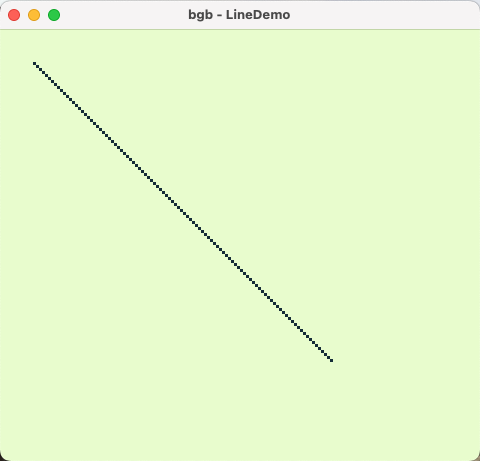

# Line Demo for Game Boy
This is a **very** simple demo of drawing a single line to the screen of a Game Boy using assembly. It is simply for demonstration purposes of how this effect can be acheived, but it's not particularly practical. Press the arrow keys to draw a line in one of four different shades. That's all it does.

